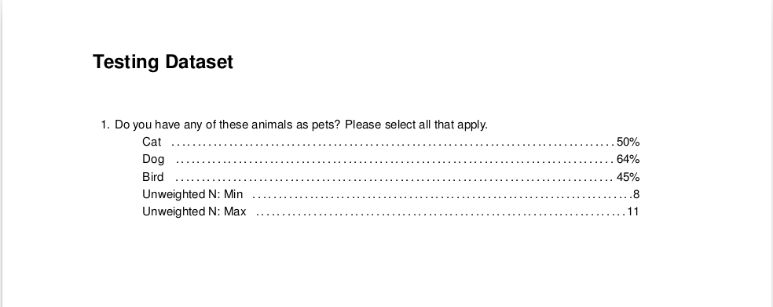
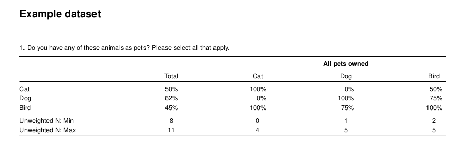
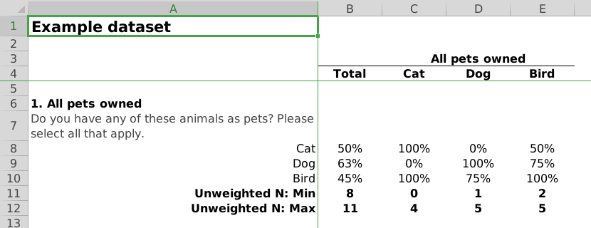

# crunchtabs

Crunchtabs allow for the automatic generation of toplines, crosstabulation and codebooks directly from a crunch dataset. 

 [](https://codecov.io/gh/Crunch-io/crunchtabs)

## Quick Start

For a broader introduction please see our [introductory vignette](https://crunch-io.github.io/crunchtabs/articles/Overview.html). For codebooks, see [codebooks]((https://crunch-io.github.io/crunchtabs/articles/Codebooks.html))

### 1. Install tinytex

To make PDF reports, you'll need a working LaTeX installation. One way to get this is with the [tinytex](https://yihui.name/tinytex/) package. Or, see https://www.latex-project.org/get/ to install everything. We strongly recommend installing tinytex because it reduces the number of potential problems. 

```
install.packages('tinytex')
tinytex::install_tinytex()
```

### 2. Install crunchtabs

```
# install.packages("remotes")
remotes::install_github("Crunch-io/crunchtabs")
```

### Create a Topline

Generating a topline report is quick and easy! 

```
# library(crunchtabs)
# login()

ds = loadDataset("Example dataset")
# Use ds = newExampleDataset() if not found!

toplines_summary <- crosstabs(dataset = ds)
writeLatex(toplines_summary, filename = "output", pdf = TRUE) # output.pdf will be written 
```




### Create a Cross Tabulation

The only additional step required for a cross tab report is to create a `banner` object. Then, setting it as the `banner` argument for the `crosstabs` function. Below, we create a cross tabulation report that shows the type of pet(s) respondents own to our survey for every question in the survey. Once you have run the code, we encourage you to open the resulting `output.pdf` file. Inside of the report you will find a cross tabulation of all questions by pet ownership.

```
# library(crunchtabs)
# login()

ds = loadDataset("Example dataset")
# Use ds = newExampleDataset() if not found!

ct_banner <- banner(ds, vars = list(`banner 1` = c('allpets')))
ct_summary <- crosstabs(dataset = ds, banner = ct_banner) # banner parameter set here
writeLatex(ct_summary, filename = "output", pdf = TRUE) # output.pdf will be written 
```




## Excel

To create documents in excel, the process is the same as that for creating PDF reports. However, in the last line of our example scripts we use `writeExcel` instead of `writeLatex` while also removing the `pdf = TRUE` argument. As with PDF reports, there are a large amount of options that can be set to adjust the look and feel of the resulting Excel spreadsheets. 

```
# ... cross tab
writeExcel(ct_summary, filename = "output") # output.xlsx will be written 

# ... topline, not yet implemented
# writeExcel(toplines_summary, filename = "output") # output.xlsx will be written 
```




## Generating Codebooks 

To generate a codebook, you must install the development version of kableExtra

```
devtools::install_github("haozhu233/kableExtra")

# library(crunchtabs)
# login()

ds = loadDataset("Example dataset")
# Use ds = newExampleDataset() if not found!

writeCodeBookLatex(ds)
```


## For developers

The repository includes a Makefile to facilitate some common tasks.

### Running tests

`$ make test`. Requires the [httptest](https://github.com/nealrichardson/httptest) package. You can also specify a specific test file or files to run by adding a "file=" argument, like `$ make test file=latex`. `test_package` will do a regular-expression pattern match within the file names. See its documentation in the `testthat` package.
