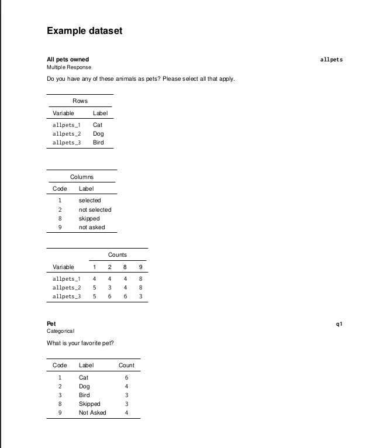
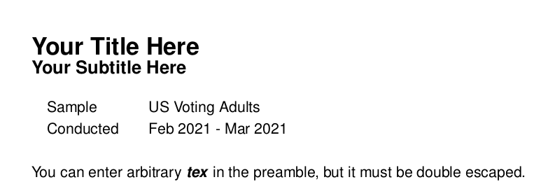

## Codebooks!

A codebook is used as a reference to document the contents of a survey by displaying unweighted counts and other types of survey metadata that may be important to someone using those data outside of the context of the crunch web application or other toplines/crosstabs prepared by crunchtabs

### Generating Codebooks

Creating a codebook from a crunch dataset is easy! In the examples below we will work with the example dataset. 

```{r, eval = FALSE}
library(crunchtabs)
login()
# If you already have an example dataset available in your account
# ds <- loadDataset("Example dataset")
ds <- newExampledataset()

writeCodeBookLatex(ds)
```




By default, if you supply a dataset to the the function `writeCodeBookLatex` it will name the resulting file after the dataset as well as set a title on the document with the same moniker. The resulting PDF document will be automatically opened after a short delay as the dataset is manipulated and written to PDF. 

In some cases, your dataset may have an extremely long or otherwise problematic name, in this case, you can use the URL to the dataset. 

```{r, eval = FALSE}
writeCodeBookLatex(ds, url = "https://api.crunch.io/datasets/<dataset-id>")
```

> Appendices: If your data contain a categorical question with more than 20 categories, it will be pushed into an appendix by default. You can control this behavior by using the parameter `appendx = FALSE`

## Options

There are a number of optional settings that you can control such as: displaying a table of contents, a sample descriptions, changing the title or subtitle, or adding a logo. In this section, we will present each of these. 

### Table of Contents

A table of contents can be added by using the `table_of_contents` parameter. Providing a table of contents that shows the variable alias (`crunch::alias`) followed by a short description of the variable that is derived from the crunch name (`crunch::name`) and, of course, the page number where the related codebook item(s) can be found.

```{r, eval = FALSE}
writeCodeBookLatex(ds, table_of_contents = TRUE)
```


### Appendices

By default, an appendix will be created for any categorical question that has more than 20 categories. This is done with the intent to avoid useless scrolling by the user. However, should you not care for an appendix you can use the parameter `appendix = FALSE`. If you choose to not use an appendix, it may also be desirable to set `suppress_zero_counts=TRUE` to avoid long presentations of empty categories in dataset order.

```{r, eval = FALSE}
writeCodeBookLatex(ds, appendix = FALSE)
```

### Titles, Sub-headings and other Descriptives

Currently you can change the title and subtitle as well as provide descriptives like sample description and field window. 

```{r, eval = FALSE}
writeCodeBookLatex(
  ds, 
  title = "An Amazing Title", 
  subtitle = "A Breathtaking Subtitle", 
  field_period = "To infinity... and beyond!",
  sample_desc = "US Voting Adults",
  preamble = "e^{ \\pm i\\theta } = \\cos \\theta \\pm i\\sin \\theta"
)
```



### Logos

Default logos for YouGov and YouGov Blue have been included in the package for easy reference. If neither have suit your purposes you can also specify a path to a PNG formatted image. We recommend an image size of 50 pixels in height and 250-350 pixels in width. If you would like your sub-brand logo added to the package please submit an issue on github (https://github.com/Crunch-io/crunchtabs/issues) 

```{r, eval = FALSE}
writeCodeBookLatex(ds, logo = "yougov")
# writeCodeBookLatex(ds, logo = "ygblue")
```


### Suppress Zeroes

Although not recommended, there are some questions that have a significant amount of zero-filled categories (country of residence for example). This can lead to the end-user of the codebook scrolling through information that is useless to them. 

```{r, eval = FALSE}
writeCodeBookLatex(ds, suppress_zero_counts = TRUE)
```

### Table Alignment

The table alignment on the page can be adjusted to one of:  "l" for left (the default), "c" for center, or "r" for right by using the `position` parameter. 

```{r, eval = FALSE}
writeCodeBookLatex(ds, position = "c")
```


