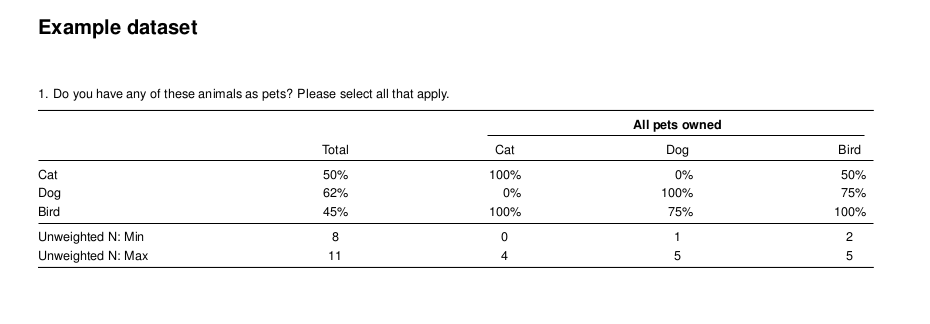
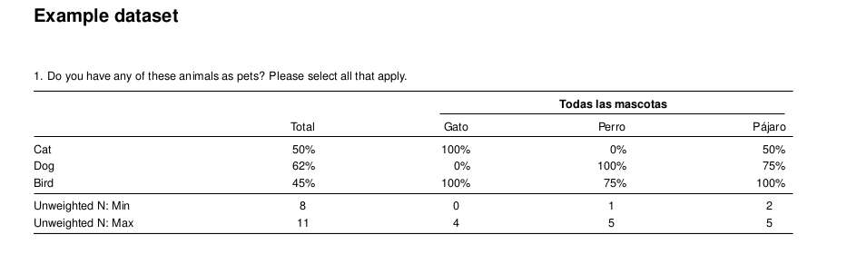
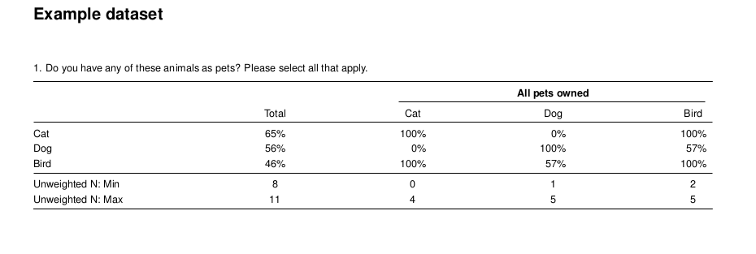
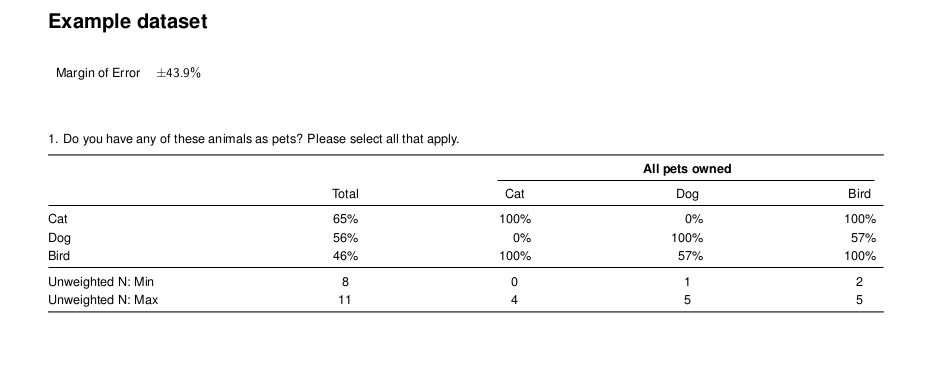
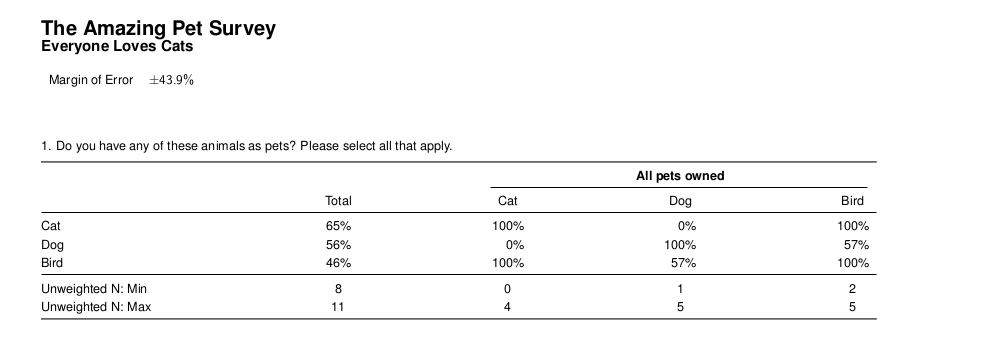
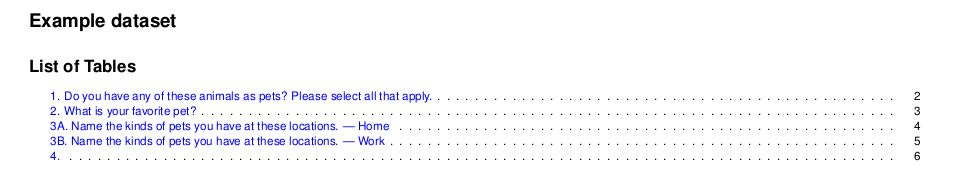
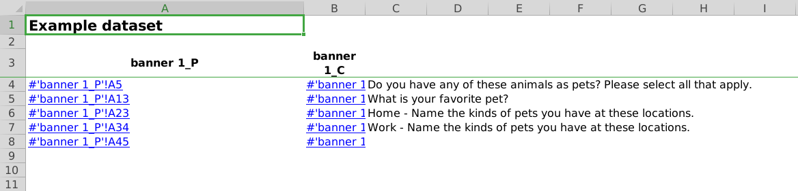
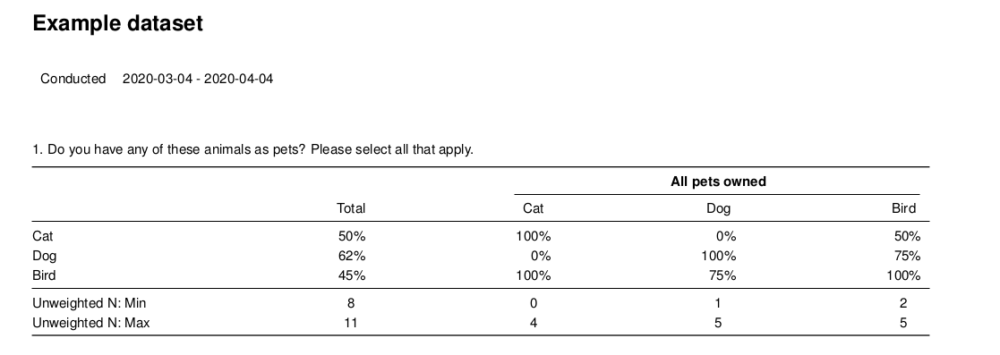
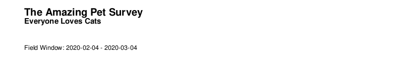
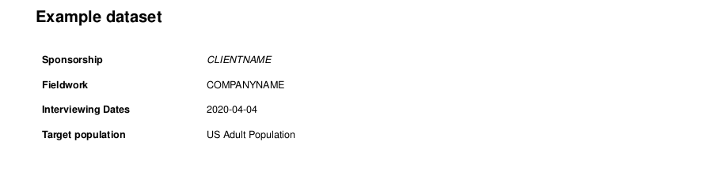

## Introduction

The `crunchtabs` package automates reporting for [crunch](https://github.com/Crunch-io/rcrunch) datasets. It is designed to create toplines, cross tabulations and codebooks (not yet implemented) as tex, pdf or xlsx. The goal of this document is to provide you with enough information to go from nothing, to a client ready report, as fast as you can type. For all of the examples included in this vignette we will work with `crunch`'s built in pet dataset. Let's first install the packages that you need: 

```{r, eval = FALSE}
remotes::install_github("Crunch-io/rcrunch") # If not already installed
remotes::install_github("Crunch-io/crunchtabs")
```

Next, let's create a personal copy of the example data set for use with this vignette. This will ensure that you have the example dataset available to your account. A rudimentary understanding of the `crunch` R package is expected from readers of this document. Anyone with a `crunch` login should be able to follow along with the examples included here. If you are not familiar with `crunch`, we recommend the [getting started](https://crunch.io/r/crunch/articles/crunch.html) vignette.

```{r, eval = FALSE}
library(crunchtabs)
login()
ds <- newExampledataset()
```

## PDF Reports

`crunchtabs` generates PDF reports by writing generated LaTeX to a file, then compiling that file. A significant amount of thought has gone into the default settings and we recommend that you stick with them. However, there is a bounty of structural and thematic options that can be adjusted or manipulated to your requirements.

### Create a Topline

Generating a topline report is quick and easy! 

```{r, eval = FALSE}
# library(crunchtabs)
# login()

ds = loadDataset("Example dataset")
# Use ds = newExampleDataset() if not found!

toplines_summary <- crosstabs(dataset = ds)
writeLatex(toplines_summary, filename = "output", pdf = TRUE) # output.pdf will be written 
```

> NOTE: Although called `crosstabs` this function serves both purposes by creating summary data for toplines and cross tabulation reports. There is no function called `toplines`.


### Create a Cross Tabulation

The only additional step required for a cross tab report is to create a `banner` object. Then, setting it as the `banner` argument for the `crosstabs` function. Below, we create a cross tabulation report that shows the type of pet(s) respondents own to our survey for every question in the survey. Once you have run the code, we encourage you to open the resulting `output.pdf` file. Inside of the report you will find a cross tabulation of all questions by pet ownership.

```{r, eval = FALSE}
# library(crunchtabs)
# login()

ds = loadDataset("Example dataset")
# Use ds = newExampleDataset() if not found!

ct_banner <- banner(ds, vars = list(`banner 1` = c('allpets')))
ct_summary <- crosstabs(dataset = ds, banner = ct_banner) # banner parameter set here
writeLatex(ct_summary, filename = "output", pdf = TRUE) # output.pdf will be written 
```




## Excel

To create documents in excel, the process is the same as that for creating PDF reports. However, in the last line of our example scripts we use `writeExcel` instead of `writeLatex` while also removing the `pdf = TRUE` argument. As with PDF reports, there are a large amount of options that can be set to adjust the look and feel of the resulting Excel spreadsheets. 

> Unfortunately, toplines reports are not currently supported for Excel. However, this is a planned feature.

```{r, eval = FALSE}
# ... cross tab
writeExcel(ct_summary, filename = "output") # output.xlsx will be written 

# ... topline, not yet implemented
# writeExcel(toplines_summary, filename = "output") # output.xlsx will be written 
```


This package was designed to allow for some elements of style and structure to pass between the two formats. However, it should not be assumed that if something works in one format it will work in another.

## Structural Elements

The default result is immediately useful for a researcher. However, there are other elements that we may wish to add or adjust before sharing with a client or internal stakeholders, such as: 

* Including or excluding questions
* Weighting our data 
* Calculating and including the margin of error
* Adding titles 
* Using a table of contents 
* Customizing the theme
* Specifying a field window (PDF Only)
* Appending additional information (PDF Only)


While some of these may be firmly within the realm of "theme" items, we separate concerns based on which functions within `crunchtabs` adjust them. For this reason _structural elements_ are those elements that are parameterized by the `writeLatex` or `writeExcel` function directly. There are many more theme elements available in the `themeNew` function but it is outside of the scope of this document. 

### Including or Excluding Questions

By default, the `crosstabs` function attempts to create a topline or cross tab for all of the aliases that are visible to it in the dataset (`names(dataset)`). Creating a subset is as easy as creating a character vector with the aliases that you are interested in including in the report. 

> An _alias_ is a name used to reference a question asked in a survey. For example, `q1` references the question "What is your favorite pet?". For more information see [aliases in crunch](https://crunch.io/r/crunch/articles/variables.html#a-rose-by-any-other-moniker-names-and-aliases)

```{r, eval = FALSE}
# library(crunchtabs)
# login()

ds = loadDataset("Example dataset")
# Use ds = newExampleDataset() if not found!

toplines_summary <- crosstabs(
  dataset = ds, 
  vars = c("allpets", "q1", "petloc")
)

writeLatex(toplines_summary, filename = "output", pdf = TRUE) # output.pdf will be written 
```

By setting the `vars` argument, you can limit the questions that are output by your call to `writeLatex` or `writeExcel`. Given that this argument is a character vector, it can also be useful to use *exclusions* if your dataset has a large number of questions: 

```{r, eval = FALSE}
# ...
toplines_summary <- crosstabs(
  dataset = ds, 
  vars = setdiff(names(ds), c("country","petloc"))
)
# ...
```

A common usage pattern is to define the variables as their own R object and then assign that object to the parameter. Remember that if you change the vector of included question aliases you must also re-run the `crosstabs` function.

```{r, eval = FALSE}
topline_vars <- c("allpets", "q1", "petloc")
topline_summary <- crosstabs(dataset = ds, vars = topline_vars)
writeLatex(toplines_summary, filename = "output") # output.pdf will be written 
```

### Recoding and Relabelling Banners

Sometimes the names presented in the banner of a crosstab are not desirable, too long, or lacking context. The `crosstabs` function has the built-in ability to recode the text labels. In the case below, we change the names of the pets from Cat, Dog, or Bird, to their Spanish equivalents. 

```{r, eval = FALSE}
# library(crunchtabs)
# login()

ds = loadDataset("Example dataset")
# Use ds = newExampleDataset() if not found!

ct_banner <- banner(
  ds, 
  vars = list(`banner 1` = 'allpets'), 
  recodes = list("allpets" = list(Cat = 'Gato', Dog = 'Perro', Bird = 'Pájaro'))
)
ct_summary <- crosstabs(dataset = ds, banner = ct_banner) # banner parameter set here
writeLatex(ct_summary, filename = "output", pdf = TRUE) # output.pdf will be written 
```


Notice that we still have "All pets owned". Let's change that as well. When we want to change the column headings, we use the recode argument. When we want to change the group header we use the labels argument. 

```{r, eval = FALSE}
# library(crunchtabs)
# login()

ds = loadDataset("Example dataset")
# Use ds = newExampleDataset() if not found!

ct_banner <- banner(
  ds, 
  vars = list(`banner 1` = 'allpets'), 
  labels = c(allpets = "Todas las mascotas"), # 
  recodes = list("allpets" = list(Cat = 'Gato', Dog = 'Perro', Bird = 'Pájaro')))
ct_summary <- crosstabs(dataset = ds, banner = ct_banner) 
writeLatex(ct_summary, filename = "output", pdf = TRUE) # output.pdf will be written 
```

Now we see that our header has been re-labelled as "Todas las mascotas".



### Weighting Data

Most research work flows include a need to apply some kind of weighting scheme. Weighting is not applied automatically by default when running the `crosstabs` function. If your dataset has already been weighted earlier in your script, you do not need to specify a weighting variable. (you can check this with: `weight(ds)`). In our example, the dataset does not have an existing weighting scheme so we must create one. Most datasets in the wild will already have one or more weighting variables available. You can check the aliases of these weighting variables by using `weightingVariables(ds)`.

For this example, we are going to weight our data so it is 75% cat lovers, 15% dog lovers and 10% bird lovers, with the _extremely plausible_ assumption that almost everyone is a cat lover at heart. 

```{r, eval = FALSE}
# library(crunchtabs)
# login()

ds = loadDataset("Example dataset")
# Use ds = newExampleDataset() if not found!

weightVariables(ds) # NULL, no weighting variables

ds$weight = makeWeight(ds$q1 ~ c(0.75, 0.15, 0.10), name = "weight")
modifyWeightVariables(ds, "weight") # Assign "weight" as the weighting variable

ct_banner <- banner(
  ds, 
  vars = list(`banner 1` = 'allpets')
)

ct_summary <- crosstabs(
  dataset = ds, 
  weight = 'weight', # Specify your weight variable explicitly
  banner = ct_banner
) 
writeLatex(ct_summary, filename = "output", pdf = TRUE) 
```

After running `modifyWeight` our dataset now has a weighting variable assigned. You can verify this with `weightVariables(ds)`. 



> NOTE: In Crunch, a "viewer" of a dataset does not have access to the individuals rows and cannot weight data or calculate margin of error using the R crunch package. 

### Calculating and Displaying Margin of Error

Communicating the margin of error for your dataset is a typical requirement faced by all researchers. In the following example, we show you an example of how to calculate margin of error based off of the weighting variable calculated in the previous section (Weighting Data). There are a variety of ways for calculating margin of error depending on your survey. Here we present a very simple abstraction using your weight variable and the weighted base. 

If you are inheriting a project from someone you will likely see some variation of the function below included in the scripts they currently use to create a cross tab. 

```{r, eval = FALSE}
# Margin of Error function
moe <- function(weightvar) {
  weights = as.vector(weightvar)
  n = sum(weights, na.rm = TRUE)
  m <- qt(0.975, n - 1) * 
    sqrt(
      (1 + (
        sd(weights, na.rm = TRUE) /
          mean(weights, na.rm = TRUE)
        )^2)
      ) * 
    sqrt(1/(4 * n))
  return(m)
}

include_moe = moe(ds$weight)

writeLatex(
  ct_summary, 
  filename = "output", 
  pdf = TRUE,
  moe = include_moe
) 
```

In the example we see the margin of error has been placed near the top of the page just below the title. A margin of error of 43.9% is a less than desirable outcome for a survey. Thankfully, this is just an example. 



> NOTE: In Crunch, a "viewer" of a dataset does not have access to the individuals rows and cannot weight data or calculate margin of error using the R crunch package.

### Adding Titles

The default title behavior assigns the dataset name as the title on each page of the report. Often the internal reference used to denote a data set is not well aligned or appropriate for other stakeholders. Below we will show you how to customize this output by using a title and a subtitle. 

```{r, eval = FALSE}
writeLatex(
  ct_summary, 
  filename = "output", 
  title = "The Amazing Pet Survey",
  subtitle = "Everyone Loves Cats",
  pdf = TRUE,
  moe = include_moe
) 
```



### Including a Table of Contents 

A small change to our call to `writeLatex` or `writeExcel` allows for the inclusion of a table of contents. In both document types this creates a "linked" table of contents that navigates to the table of interest on-click.

```{r, eval=FALSE}
writeLatex(
  ct_summary, 
  # ...,
  table_of_contents = TRUE,
  pdf = TRUE
) 

writeExcel(
  ct_summary, 
  # ...,
  table_of_contents = TRUE
)
```






### Customizing Theme

There are a large amount of theme options available for both PDF and Excel reports. Here we only provide a cursory example. We recommend reviewing `?themeNew` for more specific details about all of the elements that can be changed. We provide a few common examples below. 

```{r, eval = FALSE}
myTheme = themeNew(
  
)

writeLatex(
  ct_summary, 
  filename = "output", 
  title = "The Amazing Pet Survey",
  subtitle = "Everyone Loves Cats",
  theme = myTheme,
  pdf = TRUE,
  moe = include_moe
) 
```


### Specifying a field window (PDF Only)

There are two common patterns for specifying a field window. The first is to specify it using the `field_period` argument of the `writeLatex` function. The second is to set your field window as the `subtitle`. In the *Adding Titles* section, the `subtitle` argument accepts arbitrary text. 

```{r, eval = FALSE}
writeLatex(
  # ...
  field_period = "2020-02-04 - 2020-03-04"
) 
```



### Appending Text (PDF Only)

The string passed to `append_text` will be visible on the last page of your report.

```{r, eval = FALSE}
writeLatex(
  # ...
  append_text = "Field Window: 2020-02-04 - 2020-03-04"
) 
```



You can also append much larger chunks of text like a disclosure, analysis, or other marketing copy that is required for all of your documents. A typical workflow here is to create a .tex fragment file or an R string object that includes your copy. Tex makes significant use of the `\` character. In R, you must _escape_ the backslash with an additional backslash. In the example below you see `\begin` becomes `\\begin` and a new line `\\` becomes `\\\\`.

```{r, eval = FALSE}
myAppend = paste0(  
"

\\begin{tabular*}{5.5in}{p{2in}p{4in}}
\\textbf{Sponsorship}   &    \\emph{CLIENTNAME} \\\\
\\addlinespace \\addlinespace
\\textbf{Fieldwork}    &    COMPANYNAME \\\\
\\addlinespace \\addlinespace
\\textbf{Interviewing Dates} &  2020-04-04 \\\\
\\addlinespace \\addlinespace
\\textbf{Target population}  &  US Adult Population \\\\
\\end{tabular*}

")
```

```{r, eval = FALSE}
writeLatex(
  ct_summary, 
  filename = "output", 
  pdf = TRUE,
  append_text = myAppend
) 
```

 

## Seeking Commentary

We are always seeking feedback on this and other documents or features of `crunchtabs`. Feel free to leave an [issue](https://github.com/Crunch-io/crunchtabs/issues)

> No pets were harmed in the making of this vignette.
