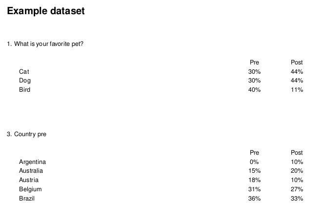

## Reporting Over Time

`crunchtabs` supports two distinct forms of tracking reports. A recontact report, where the same questions have been asked in the same dataset over time and require individual weighting. An example of this would be a political survey, where we ask about voter intention before and after a debate. The second, is a tracking report, where the same questions have been asked in different datasets and require individual weighting.

### Generating a Recontact Report

In the code below, we use the crunch example dataset to illustrate the setup required for recontact style reporting. There are a few important assumptions about the naming and setup of your data that are critical to the success of this function: 

1. Your "pre" and "post" waves questions should both have the same categories. 
2. Your "pre" and "post" waves question names should be equal, with different suffixes, such as: question_pre and question_post.

```{r, eval = FALSE}
library(crunchtabs)
login()

# Create an example dataset
ds <- newExampleDataset()
ds <- loadDataset("Example dataset")

# Generate weights
ds$weight1 <- makeWeight(ds$q1 ~ c(0.3,0.3,0.4,0), name = 'weight1')
ds$weight2 <- makeWeight(ds$q1 ~ c(0.4,0.4,0.1,0.1), name = 'weight2')

# Oddity of crunch, you can't use a weight in a tabBook that
# has never been applied to the dataset. 
weight(ds) <- ds$weight1
weight(ds) <- ds$weight2
weight(ds) <- ds$weight1

# Fake pre and post questions
ds$q1_pre <- copyVariable(ds$q1, deep = TRUE, name = "Pet name pre")
ds$q1_post <- copyVariable(ds$q1, deep = TRUE, name = "Pet name post")
ds$country_pre <- copyVariable(ds$country, deep = TRUE, name = "Country pre")
ds$country_post <- copyVariable(ds$country, deep = TRUE, name = "Country post")

ct <- recontact_toplines(
  ds,
  questions = c("q1", "country"),
  suffixes = c("_pre", "_post"),
  labels = c("Pre", "Post"),
  weights = c("weight1", "weight2")
)


theme <- themeNew(default_theme = themeDefaultLatex(), one_per_sheet = FALSE)
writeLatex(ct, pdf = TRUE, open = TRUE, theme = theme)
```


### Flipping Grids

Often the case may be that your category labels are long, and your wave descriptors are very short. In this case, crunchtabs provides optiosn for "flipping grids". That is to say, there are options you can provide to transpose the presentation so that the wave labels are columns, and the category labels are rows.

To do so globally, we set the `latex_flip_gris` theme option to `TRUE`:

```{r, eval = FALSE}
theme <- themeNew(..., latex_flip_grids = TRUE)
```

 In addition to global transposition of grids, we can also do so conditionally.

```{r, eval = FALSE}
theme <- themeNew(..., latex_flip_specific_grids = c("q1"))
```

### Tracking Reports

While recontact reports are designed for questions asked in the same dataset, we also have the ability to present questions asked in multiple datasets in a similar fashion.

In the code block below, we illustrate data setup and an example call to `tracking_reports`. While our example is not prepresentative of a real-life situation, the manner in which you would need to manage data are the same.

```{r, eval = FALSE}
# Create example datasets as waves 1,2 and 3.
ds1 <- newExampleDataset()
name(ds1) <- "Example dataset W1"

ds2 <- newExampleDataset()
name(ds2) <- "Example dataset W2"

ds3 <- newExampleDataset()
name(ds3) <- "Example dataset W3"

# Create weights
ds1$weight1 <- makeWeight(ds1$q1 ~ c(0.3,0.3,0.4,0), name = 'weight1')
ds2$weight1 <- makeWeight(ds2$q1 ~ c(0.4,0.4,0.1,0.1), name = 'weight1')
ds3$weight1 <- makeWeight(ds3$q1 ~ c(0.2,0.2,0.4,0.2), name = 'weight1')

# Ensure each dataset has a weight
weight(ds1) <- ds1$weight1
weight(ds2) <- ds2$weight1
weight(ds3) <- ds3$weight1

# Create a theme
theme <- themeNew(
  default_theme = themeDefaultLatex(), 
  latex_flip_grids = TRUE
)

# Prepare the data object
ct <- tracking_report(
  dataset_list = list(ds1, ds2, ds3), 
  vars = c("allpets", "q1", "petloc"),
  wave_labels = NULL
)

# Write to latex and convert to pdf
writeLatex(ct, pdf = TRUE, theme = theme)

```

There are a number of important elements here:

1.  The order of `dataset_list` will be the same as their presentation in the resulting PDF. There are no checks to verify their order. Order your dataset from oldest to youngest. Or, if your data are bound by some other element that is not time (like the same survey ran in different localities) consider listing the datasets in alphabetical order.

2.  The default `wave_labels` will be presented as Wave 1 through Wave N, where N is the length of the `dataset_list`

3.  It is strongly recommended that you weight each dataset with the same variable. The `weight` parameter accepts a character string that should reference a weighting variable in your datasets by its alias. Should you not specify a weight, the system will use the current weighting of each dataset. This can be useful if you have differently named weights across the datasets. But caution should be taken here as there is no way for the system to verify that your desired weight has been applied. As you saw in the example, it's recommended to assign your weight deliberately.

4.  Many defaults are extracted from the first dataset in the `dataset_list`.

    

### Other Stacking Data

As intimated in the previous section, tracking reports accept any list of datasets. This means they can be used for a variety of situations where one needs to present a number of datasets in a stacked manner. Although called "tracking reports" they support any situation where the same questions are found in a list of datasets.

In the example below, we show a political survey question that was asked in different cities across the United States of America regarding no-knock warrants.


Although you will not be able to recreate this code locally, below is a recommended approach for aggregating similarly named datasets: 

```{r, eval=FALSE}
library(crunchtabs)
login()

# Dataset names tend to have minor variation, in this case it was the place:
places <- sort(c("St Louis", "Memphis", "Detroit", "Charlotte", "Baltimore", "Birmingham"))
ds_names <- sprintf("Campaign Zero %s October 2020", places)
ds_list <- lapply(ds_names, loadDataset)

# Specify the variable(s). They must exist in all datasets
vars <- c("noknock_supop")

# Create the results object
ct <- tracking_report(
  ds_list, wave_label = places, 
  vars = vars)

# Write to latex
writeLatex(ct, pdf = TRUE)
```

