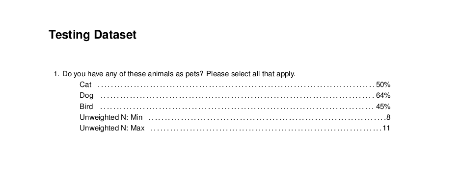

The `crunchtabs` package creates reports using [crunch](https://github.com/Crunch-io/rcrunch) data sets. A rudimentary understanding of the `crunch` R package is expected from readers of this document. Anyone with a `crunch` login should be able to follow along with the examples included here. Don't have a `crunch` account? . `crunchtabs` can be used to produce three types of reports: toplines, cross tabulations, and codebooks (not yet implemented). Each of these can be saved as a \*.tex, a \*.pdf or an \*.xlsx file.

The goal of this document is to provide you with enough information to go from nothing, to a client ready report, fast. For all of the examples included in this vignette we will work with `crunch`'s built in pet dataset. So if you've never worked with crunch before, start by running the following: 

```{r, eval = FALSE}
library(crunch)
login()
ds <- newExampledataset()
```


## PDF Reports

`crunchtabs` generates PDF reports by writing custom LaTeX to a file, then compiling that file. A significant amount of thought has gone into the default settings and we strongly recommend that you stick with them. With that said, there is a bounty of structural and thematic options that can be adjusted or manipulated to your requirements.

### Create a Topline

Generating a topline report is quick and easy!

```{r, eval = FALSE}
library(crunchtabs)
library(crunch)

login()

ds = loadDataset("Example dataset")
# Use ds = newExampleDataset() if not found!

toplines_summary <- crosstabs(dataset = ds)
writeLatex(toplines_summary, filename = "output", pdf = TRUE) # output.pdf will be written 
```

NOTE: Although called `crosstabs` this function serves both purposes by creating summary data for toplines and cross tabulation reports

{width=650px}

### Create a Cross Tabulation

The only additional step required for a cross tab report is to create a banner object. Then, setting it as the `banner` argument for the `crosstabs` function. 

```{r, eval = FALSE}
library(crunchtabs)
library(crunch)

login()

ds = loadDataset("Example dataset")
# Use ds = newExampleDataset() if not found!

ct_banner <- banner(ds, vars = list(`banner 1` = c('gender', 'age3')))
ct_summary <- crosstabs(dataset = ds, banner = ct_banner) # banner parameter set here
writeLatex(ct_summary, filename = "output", pdf = TRUE) # output.pdf will be written 
```
{width=650px}

## Excel

To create documents in excel, the process is the same as that for creating PDF reports. However, in the last line of our example scripts we use `writeExcel` instead of `writeLatex` while also removing the `pdf = TRUE` argument. As with PDF reports, there are a large amount of options that can be set to adjust the look and feel of the resulting Excel spreadsheets. 

```{r, eval = FALSE}
# ... topline
writeExcel(toplines_summary, filename = "output") # output.xlsx will be written 
# ... cross tab
writeExcel(ct_summary, filename = "output") # output.xlsx will be written 
```

{width=650px}

## Structural Elements

While the default result is immediately useful for a researcher there are other elements that we often wish to add before sharing with a client or other internal stakeholders, such as: including or excluding questions, adding titles, specifying a field window, identifying the margin of error, or including a logo.

### Selecting Questions to Include

Often there are questions that you may not wish to include. By default, the `crosstabs` function attempts to create a topline or cross tab for all of the aliases that are visible to it in the dataset (`names(dataset)`). Creating a subset is as easy as creating a character vector with the aliases that you are interested in including in the report. 

NOTE: An _alias_ is a name used to reference a question asked in a survey. For example, `age4` references a recategorization of those data for the question "What is your age?".

```{r, eval = FALSE}
library(crunchtabs)
library(crunch)

login()

ds = loadDataset("Example dataset")
# Use ds = newExampleDataset() if not found!

toplines_summary <- crosstabs(dataset = ds, vars = c("allpets", "q1", "petloc"))
writeLatex(toplines_summary, filename = "output", pdf = TRUE) # output.pdf will be written 
```

By setting the `vars` argument, you can limit the questions that are output by your call to `writeLatex` or `writeExcel`. Given that this argument is a character vector, it can also be useful to use *exclusions* if your dataset has a large number of questions: 

```{r, eval = FALSE}
# ...
toplines_summary <- crosstabs(
  dataset = ds, 
  vars = setdiff(names(ds), c("alias2exclude1","alias2exclude2"))
)
# ...
```

A common usage pattern is to define the variables as their own R object and then assigning that object to the parameter. Remember that if you change the vector of included question aliases you must also re-run the `crosstabs` function.

```{r, eval = FALSE}
topline_vars <- c("alias1", "alias2", "alias3")
topline_summary <- crosstabs(dataset = ds, vars = topline_vars)
writeLatex(toplines_summary, filename = "output") # output.pdf will be written 
```

### Recoding Banners

Sometimes the names presented in the banner of a crosstab are not desirable, or just too long. The `crosstabs` function has the built-in ability to recode the text labels. 

```{r, eval = FALSE}
library(crunchtabs)
library(crunch)

login()

ds = loadDataset("Example dataset")
# Use ds = newExampleDataset() if not found!

ct_banner <- banner(ds, vars = list(`banner 1` = 'allpets'), recodes = list("allpets" = list(Cat = 'Gato', Dog = 'Perro', Bird = 'Pájaro')))
ct_summary <- crosstabs(dataset = ds, banner = ct_banner) # banner parameter set here
writeLatex(ct_summary, filename = "output", pdf = TRUE) # output.pdf will be written 
```

{width=650px}

In the case above, we see that the names of the pets have changes from Cat, Dog, or Bird, to their Spanish equivalents. 

### Weighting Data

### Calculating Margin of Error

NOTE: In Crunch, a "viewer" of a dataset does not have access to the individuals rows and cannot weight data or calculate margin of error. 

## Theming

### Fonts and Typography

### Spacing

### Backgrounds

### Borders

### Common Theme Options

There are a large number of theme related options. In this section we wil cover some of the more basic elements. 

## FAQ

### How do I hide question numbers?

A number of theme options exist for this purpose, `format_var_alias`, `format_var_description`, `format_var_filtertext`, and `format_var_name`. In your format list, set an item `include_q_number = FALSE` as in the example below.

```{r, eval = FALSE}
myAwesomeTheme = themeNew(
  ..., # your other theme options
  format_var_description = list(include_q_number = FALSE),
  format_var_filtertext = list(include_q_number = FALSE)
)
```

### How do I make it so that there is more than one question per page?

```{r, eval = FALSE}
myAwesomeTheme = themeNew(
  ...,
  one_per_sheet = FALSE
)
```

### How do I output numbers like 1,000 instead of 1000?

```{r, eval = FALSE}
format(1000, nsmall=0, big.mark=",")
```

### How do I add a subtitle to my document?

A common usage of the subtitle is to include the survey's field window. Especially for studies that are run continuously.

```{r, eval = FALSE}
writeLatex(
  ...,
  subtitle = "My Amazing Subtitle"
)
```

### How do I append more information?

### How do I mask questions with low base sizes?

Below is an example of masking responses where the base size is less than the central limit theorum with a "-" character.

```{r, eval = FALSE} 
myAwesomeTheme = themeNew(
  ...,
  format_min_base = list(mask = "-", min_base = 30)
)
```

### How do I request a new feature? 

We welcome features requests as new issues to the [crunchtabs github repository](https://github.com/Crunch-io/crunchtabs/issues)
